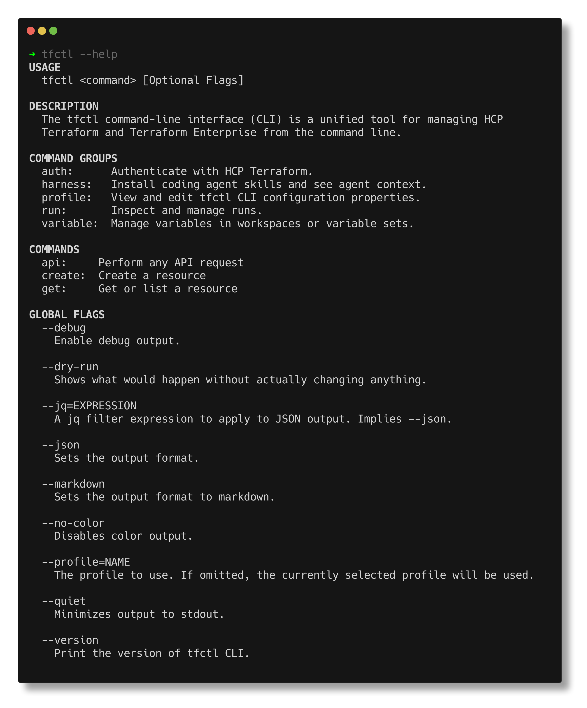

# tfctl: The HCP Terraform CLI

[](https://opensource.org/licenses/MPL-2.0)

Comprehensive, official CLI access to the HCP Terraform / Terraform Enterprise platform.

The `tfctl` CLI  provides high-level commands for common workflows, such as managing runs, variables, and workspaces, and direct API access for advanced automation. It supports multiple configuration profiles, allowing you to switch between different HCP Terraform organizations and Terraform Enterprise instances. It also integrates with AI coding agents to facilitate agent-assisted management of Terraform workflows.


## Installation
You can install the CLI, command completion utility, and agent skill separately.  

### Homebrew

MacOS and Linux users can install tfctl from the HashiCorp brew tap:

```bash
$ brew install hashicorp/tap/tfctl
```

### Precompiled Binaries

You can download official release binaries at [releases.hashicorp.com](https://releases.hashicorp.com/tfctl/)

### Building from Source

See [Developers](#developers) below for details.

## Install shell completion

We recommend installing the shell completion module for command, argument, and API path completion.

```bash
$ tfctl --autocomplete-install
```

You can uninstall shell completion with the `tfctl --autocomplete-uninstall` command.

## Install AI agent skill

The `tfctl` CLI ships with an agent skill that gives AI coding agents access to HCP Terraform through the `tfctl` command, but discourages non-human delete operations. You can install it using the `tfctl harness install` command or NPX. Replace `<agent>` with one of the following supported AI agents:

- `amp`
- `antigravity`
- `bob` 
- `claude`
- `codex`
- `copilot`
- `opencode`
- `pi`

To install the skill with `tfctl harness install` command, run:

```bash
$ tfctl harness install <agent> --global
```

To install the skill for other agents using npx skills, run:

```bash
$ npx skills add hashicorp/tfctl-cli --skill 'tfctl'
```

This adds the skill to your user profile so that compatible agents can use `tfctl` commands on your behalf.

## Configure tfctl

The `tfctl` CLI uses a layered configuration system. You can configure settings in profiles, environment variables, or local Terraform configuration, in order of precedence.

### Set hostname

The default hostname is the HCP Terraform instance at `app.terraform.io`. To use a different HCP Terraform instance or your organization's Terraform Enterprise instance, use the `tfctl profile set hostname` command and specify the hostname you want the CLI to connect to.

```bash
$ tfctl profile set hostname <host>
```

### Set authentication token

Run the `tfctl auth login` command to create and install a token for `tfctl` to use to authenticate with HCP Terraform or Terraform Enterprise. If you already have a token, you can use `tfctl profile set token $TOKEN`.

```bash
$ tfctl auth login
```

The command opens HCP Terraform or your Terraform Enterprise instance in a browser window. Click the **Create an API token** button, then give your token a description and set its expiration. Click **Generate token**, then copy and paste the new token into your terminal window. The CLI does not print the pasted token to the screen. As with Terraform, `tfctl` stores these tokens in plain text. Refer to [Configuration reference](#configuration-reference) for more information.

Verify that the login is successful before leaving the token page in your browser, because HCP Terraform does not show the token once it's closed. If an issue occurs during the process or you close the dialog showing the token before copying it, you must create a new token.

If the CLI does not find a token configured for the active profile, it checks your Terraform configuration for a matching token. Refer to [Terraform tokens](#terraform-tokens) for more information.

### Set default organization

Run the `tfctl profile set default_organization` command to set the default organization. Replace `<name>` with your HCP Terraform or Terraform Enterprise organization name.

```bash
$ tfctl profile set default_organization <name>
```

## Example usage

**Command Syntax:** `tfctl <command> [subcommand] [flags] [arguments]`

```bash
# Scenario: Check the status of two workspaces across two instances of HCP Terraform. Start a run on a workspace.

# Configure profiles for EU and US organizations, and authenticate to both. You must already have users with access to the organizations in each HCP Terraform instance.
$ tfctl profile profiles create us --hostname=app.terraform.io
$ tfctl profile set default_organization my-us-org-name
$ tfctl auth login # Create API token in web browser, copy it, then paste it to terminal

$ tfctl profile profiles create eu --hostname=app.eu.terraform.io
$ tfctl profile set default_organization my-eu-org-name
$ tfctl auth login # Create API token in web browser, copy it, then paste it to terminal

# Get workspace configuration from EU org. Workspace must already exist in this org.
$ tfctl api /organizations/{organization}/workspaces/example-app-workspace

# Get status of last workspace run
$ tfctl run status example-app-workspace

# Switch to US profile
$ tfctl profile profiles activate us

# Start a run on the US workspace. Workspace must already exist in this org.
$ tfctl run start example-app-workspace --message="Run started with tfctl."

# Get detailed run status in JSON format
$ tfctl run status example-app-workspace --json
```

### Manage profiles

Use the `tfctl profile profiles` command group to create and manage profiles. You can use a different profile for each HCP Terraform organization and each instance of HCP Terraform and instance of Terraform Enterprise.

To create a profile, run the `tfctl profile profiles create` command and specify a name to create a profile. Replace `<name>` with a name for your new profile.

```bash
$ tfctl profile profiles create <name>
```

The CLI activates the new profile automatically.

### Run `tfctl` in Docker

If you have a `TFCTL_TOKEN` environment variable set, you can invoke `tfctl` using Docker. Refer to [Environment variables](#environment-variables) for more configuration environment variables.

For example, the following command will run `tfctl` in a docker container, passing the local `TFCTL_TOKEN` environment variable into the container:

```bash
$ docker run -e TFCTL_TOKEN hashicorp/tfctl
```

## Configuration reference

The `tfctl` CLI stores its configuration in the following directories, depending on your operating system:

- Linux/MacOS: `~/.config/tfctl`
- Windows: `%AppData%/tfctl`

The CLI stores configuration for individual profiles in the `profiles` subdirectory. For example, `profiles/default.hcl` stores the configuration for your default profile.

### Terraform tokens

If you have not configured a token for the active profile with `tfctl auth login`, the `tfctl` CLI checks your Terraform configuration for a matching token. These tokens may either be in your Terraform configuration directory, for example `~/.terraform.d/credentials.tfrc.json`, or the corresponding Terraform environment variables, such as `TF_TOKEN_app_terraform_io`.

### Environment variables

If you have not configured a particular option for the active profile, `tfctl` checks the following environment variables:

`TFCTL_ORGANIZATION`: The organization to use for commands that require an organization.

`TFCTL_HOSTNAME`: The Terraform Enterprise or HCP Terraform hostname to use. Defaults to `app.terraform.io`.

`TFCTL_TOKEN`: An HCP Terraform API token to use in conjunction with the default profile. This variable is not used in conjunction with any other profile.

`TFCTL_TOKEN_<profile>`: An HCP Terraform API token to use in conjunction with the named profile.

`TF_TOKEN_<hostname>`: An HCP Terraform API token to present during authentication, with the specified hostname in Punycode formatting, for example `TF_TOKEN_app_terraform_io`. The CLI present the Terraform token only if it has not been configured in any other way.

## Command reference



The `tfctl` command can manage HCP Terraform runs and variables with the corresponding subcommands. It also provides direct access to the HCP Terraform API with the `api` subcommand.

### Global flags

`tfctl` supports the following global flags.

- `--help`: Detailed usage instructions for any command.

- `--debug`: Enable debug output.

- `--dry-run`: Creates a preview of the proposed changes.

- `--json`: Sets the output format to JSON.

- `--jq=<expression>`: A jq filter expression to apply to JSON output. Implies `--json`

- `--markdown`: Sets the output format to Markdown

- `--no-color`: Disables color output.

- `--profile=<name>`: The profile to use. If omitted, the CLI uses the current profile.

- `--quiet`: Minimizes output, rendering only essential content.

- `--version`: Print the version of `tfctl` CLI.

### Exit Codes

| Exit | Meaning                          | Solution                              |
|------|----------------------------------|---------------------------------------|
| 0    | OK                               | &mdash;                               |
| 1    | Usage error                      | Read `tfctl <cmd> --help`             |
| 2    | Not Found or Authorization Error | Verify URL/ID                         |
| 3    | Authentication Error             | `tfctl auth login`                    |
| 4    | Network error                    | Check connectivity                    |
| 5    | API Server Error Persists        | Try again later                       |
| 6    | Underlying error detected        | Varies depending on error condition   |
| 130  | Canceled (ctrl-c).               | &mdash;                               |


### Telemetry

By default, HashiCorp collects anonymous, redacted trace telemetry for each command invocation, including the command name, exit status, network metrics, and basic process information. You can disable telemetry using any of these methods: Set `TFCTL_TELEMETRY` to `disabled`, Set `DO_NOT_TRACK` to `true`, or set telemetry to disabled in your profile: 

```bash
$ tfctl profile set telemetry disabled
```

You can view the telemetry that we transmit by setting profile telemetry to `log`:

```bash
$ tfctl profile set telemetry log
```

See [TELEMETRY.md](TELEMETRY.md) for more information, including full trace schema.

### Uninstall/Clean up

**Uninstall Shell Completions**

```bash
$ tfctl --autocomplete-uninstall
```

## Developers

### Installing from Source

#### Prerequisites

- go v1.26.4 or later
- git
- make

#### Install `tfctl`

1. Clone the git [repository](https://github.com/hashicorp/tfctl-cli):
   - SSH: `git clone git@github.com:hashicorp/tfctl-cli.git`
   - HTTPS: `git clone https://github.com/hashicorp/tfctl-cli.git`
1. Change to the new directory: `cd tfctl-cli`
1. Run `make go/install`.

Verify the installation:

```bash
$ tfctl --version
```

### Developers

See [CONTRIBUTING.md](CONTRIBUTING.md) for information about developing tfctl.