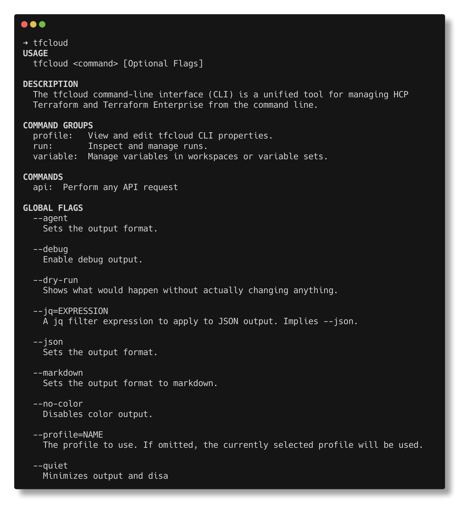

## tfcloud: The HCP Terraform CLI

Effectively interact with the HCP Terraform platform.



#### Quick Start

tfcloud uses a host-centric, layered configuration with a logical precedence. Configuration commands
do not yet exist in the CLI, so start by writing this file to `$HOME/.config/tfcloud/profiles/default.hcl`
(or `%AppData%/tfcloud/profiles/default.hcl` on Windows) substituting your own hostname, token, and organization.

```hcl
name         = "default"
organization = "default-organization"
hostname     = "app.staging.terraform.io"
token        = "TOKEN"
```

```
# Migrate a tfvars file to the current workspace
tfcloud variable import bigsecret.tfvars

# Migrate a tfvars file to a new variable set
tfcloud variable import bigsecret.tfvars -variable-set-name "production"

# Migrate ENV variables available to the current workspace
tfcloud variable import -e AWS_REGION -e AWS_ACCESS_KEY_ID -e AWS_SECRET_ACCESS_KEY

# Execute any API v2 GET query
tfcloud api /account/details # Table format
tfcloud api /organizations -json # JSON format

# Execute any POST query by specifying -a for request body attributes in key=value format or -i for raw request body input
tfcloud api /organizations/acme/projects -a "name=my-project" -a "description=it\'s a very fine project"

# ...or use a JSON input file as the body
tfcloud api /organizations/acme/projects -input my-project.json

# ...or use stdin as the request body
./generate_hcptf_run.sh | tfcloud api /runs -input -

# This example fetches all pages of data (up to 1000 items) and sorts by latest runs
tfcloud api /organizations/acme/workspaces --all -f "sort=-current-run.created-at"
```

#### Shell Completion

**Install**

```
$ tfcloud --autocomplete-install
```

**Uninstall**

```
$ tfcloud --autocomplete-uninstall
```

#### Configuration Reference

**Profile-level Configuration**

Linux/MacOS: `~/.config/tfcloud/profiles/default.hcl`
Windows: `%AppData%/tfcloud/profiles/default.hcl`

**Token created by `terraform login`**

`~/.terraform.d/credentials.tfrc.json` is checked for the configured hostname if the token is not set by configuration file.

**Environment Variable Configuration**

If information is not found in the profile, the following environment variables will be used for configuration:

`TFCLOUD_ORGANIZATION`: The default organization to use, where one might apply.

`TFCLOUD_HOSTNAME`: The Terraform Enterprise or HCP Terraform hostname to use. (Defaults to `app.terraform.io`)

`TFCLOUD_TOKEN`: An API token to use in conjunction with the default profile.

`TFCLOUD_TOKEN_<profile>`: An API token to use in conjunction with the named profile.

`TF_TOKEN_<hostname>`: An API token to use with the specified hostname with punycode formatting, e.g. `TF_TOKEN_app_terraform_io`, only used if the token is not specified in any other way.

#### Usage

You can use `tfcloud <command> --help` for detailed usage instructions.

**`tfcloud api <path> [flags]`**

Perform an API request. See `tfcloud api --help` for usage and examples.

#### Exit Codes

| Exit | Meaning                          | Solution                    |
|------|----------------------------------|-----------------------------|
| 0    | OK                               | &mdash;                     |
| 1    | Usage error                      | Read `tfcloud <cmd> --help` |
| 2    | Not Found or Authorization Error | Verify URL/ID               |
| 3    | Authentication Error             | `tfcloud auth login`        |
| 4    | Network error                    | Check connectivity          |
| 5    | API Server Error Persists        | Try again later             |
| 6    | Underlying error detected        | Command succeeded but found a problem |
| 130  | Canceled (ctrl-c).               | &mdash;                     |